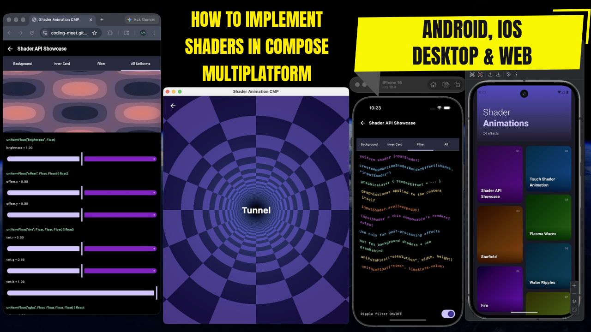

# Shader Compose Multiplatform App ✨

[](https://coding-meet.github.io/Shader-Animation-CMP/)

How to Implement Shaders in Compose Multiplatform (Android, iOS, Desktop & Web)

Medium Article:
https://medium.com/@meet26/how-to-implement-shaders-in-compose-multiplatform-android-ios-desktop-web-c86a36dd9666

Web Demo:
https://coding-meet.github.io/Shader-Animation-CMP/

Demo Video:

https://github.com/user-attachments/assets/bdee06b1-c11c-41f4-bd18-36069f7d26b1

Inspired by https://21st.dev/community/components/s/shader

---

## Platform Support

| Platform                          | Shader Engine               | Language | Status              |
|-----------------------------------|-----------------------------|----------|---------------------|
| Android 13+                       | `RuntimeShader` (AGSL)      | AGSL     | ✅ Full support      |
| Android < 13                      | —                           | —        | ✅ Graceful fallback |
| iOS                               | Skia `RuntimeShaderBuilder` | SkSL     | ✅ Full support      |
| Desktop (Windows / macOS / Linux) | Skia `RuntimeShaderBuilder` | SkSL     | ✅ Full support      |
| Web (WASM)                        | Skia via WebGL/WebGPU       | SkSL     | ✅ Full support      |
| Web (JS)                          | Skia via WebGL/WebGPU       | SkSL     | ✅ Full support      |

---

## Tech Stack

| Library / Tool        | Version |
|-----------------------|---------|
| Kotlin Multiplatform  | 2.3.20  |
| Compose Multiplatform | 1.10.3  |
| Android Gradle Plugin | 8.13.2  |
| Min SDK (Android)     | 24      |
| Compile / Target SDK  | 36      |

---

## Shader Effects (24 screens)

| #  | Screen                 | #  | Screen           |
|----|------------------------|----|------------------|
| 1  | Shader API Showcase    | 13 | Shader Hero      |
| 2  | Touch Shader Animation | 14 | Anomalous Matter |
| 3  | Plasma Waves           | 15 | Diamond Rings    |
| 4  | Starfield              | 16 | Liquid Chrome    |
| 5  | Water Ripples          | 17 | Hologram         |
| 6  | Fire                   | 18 | Supernova        |
| 7  | Ocean Waves            | 19 | Warp Speed       |
| 8  | Matrix Rain            | 20 | Magnetic Field   |
| 9  | Neon Pulse             | 21 | Glitch Art       |
| 10 | Tunnel                 | 22 | Ink Smoke        |
| 11 | Fractal Clouds         | 23 | Neon Orbit       |
| 12 | Nebula                 | 24 | Plasma Globe     |

---

## Architecture — Shader Abstraction Layer

The shader API is abstracted using Kotlin's `expect`/`actual` mechanism, so shader code is written
once in `commonMain` and runs on all platforms.

```
commonMain/expect_shader/
├── ShaderProvider.kt       ← uniform interface (all platforms)
└── ShaderUtils.kt          ← expect declarations + composable helpers

androidMain/expect_shader/
├── ShaderProviderImpl.kt   ← Android 13+ (RuntimeShader / AGSL)
└── ShaderUtils.android.kt

skikoCommonMain/expect_shader/
├── ShaderProviderImpl.kt   ← iOS / Desktop / Web (Skia / SkSL)
└── ShaderUtils.skikoCommon.kt
```

Two rendering paths are supported:

| Path                  | API                              | Use case                                       |
|-----------------------|----------------------------------|------------------------------------------------|
| Background / fill     | `drawBehind` + `ShaderBrush`     | Animated backgrounds, texture fills            |
| Filter / post-process | `graphicsLayer { renderEffect }` | Distortion, blur, color grading on existing UI |

---

## How to Run

**Android**
Open in Android Studio and run the `composeApp` configuration on a device or emulator.

**Desktop**

```bash
./gradlew :composeApp:run
```

**Web (WASM)**

```bash
./gradlew :composeApp:wasmJsBrowserDevelopmentRun
```

**iOS**
Open `iosApp/iosApp.xcodeproj` in Xcode and run on a simulator or device.

> Shader effects on Android require API 33 (Android 13+). On older devices the app runs normally
> without shader effects — no crash, no special handling needed.

---

## Contributing 🤝

Feel free to contribute to this project by submitting issues, pull requests, or providing valuable
feedback. Your
contributions are always welcome! 🙌

## ❤ Show your support

Give a ⭐️ if this project helped you!

<a href="https://www.buymeacoffee.com/codingmeet" target="_blank">

</a>

Your generosity is greatly appreciated! Thank you for supporting this project.

## Connect with me

[](https://youtube.com/@CodingMeet26?si=FuKwU-aBaf_5kukR)
[](https://www.linkedin.com/in/coding-meet-a74933273/)
[](https://twitter.com/CodingMeet)

## Author

**Meet**